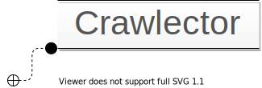

  

# Crawl*e*ctor

Crawlector (the name Crawlector is a combination of **Crawl***er* & *Det***ector**) is a threat-hunting framework designed for scanning websites for malicious objects.

**Note-1**: The framework was first presented at the [No Hat](https://www.nohat.it/2022/talks) conference in Bergamo, Italy on October 22nd, 2022 ([Slides](https://www.nohat.it/2022/static/slides/crawlector.pdf), [YouTube Recording](https://youtu.be/-9bupVXHo5Y)). Also, it was presented for the second time at the [AVAR](https://aavar.org/cybersecurity-conference/index.php/crawlector-a-threat-hunting-framework/) conference, in Singapore, on December 2nd, 2022.

**Note-2**: The accompanying tool [EKFiddle2Yara](https://github.com/MFMokbel/EKFiddle2Yara) (*is a tool that takes EKFiddle rules and converts them into Yara rules*) mentioned in the talk, was also released at both conferences.

**Note-3**: Version 2.0 (Photoid Build:180923), a milestone release, has been released on September 18, 2023.

**Note-4**: Version 2.1 (Universe-647 Build:03102), has been released on October 03, 2023. A major addition is the Slack Alert Notification feature.

# Features

- Supports spidering websites for finding additional links for scanning (up to 2 levels only)
- Integrates Yara as a backend engine for rule scanning
- Supports online and offline scanning
- Supports crawling for domains/sites' digital certificate
- Supports querying URLhaus for finding malicious URLs on the page
- Deep Object Extraction (DOE)
- Slack Alert Notification
- Parametrized support for HTTP redirection
- Retreiving Whois information
- Supports hashing the page's content with [TLSH (Trend Micro Locality Sensitive Hash)](https://github.com/trendmicro/tlsh), and other standard cryptographic hash functions such as md5, sha1, sha256, and ripemd128, among others
  - TLSH won't return a value if the page size is less than 50 bytes or not "enough amount of randomness" is present in the data
- Supports querying the rating and category of every URL
- Supports expanding on a given site, by attempting to find all available TLDs and/or subdomains for the same domain
  - This feature uses the [Omnisint Labs](https://omnisint.io/) API (this site is down as of March 10, 2023) and RapidAPI APIs
  - TLD expansion implementation is native
  - This feature along with the rating and categorization, provides the capability to find scam/phishing/malicious domains for the original domain
- Supports domain resolution (IPv4 and IPv6)
- Saves scanned website pages for later scanning (can be saved as a zip compressed)
- The entirety of the framework’s settings is controlled via a single customizable configuration file
- All scanning sessions are saved into a well-structured CSV file with a plethora of information about the website being scanned, in addition to information about the Yara rules that have triggered
- Many other features...
- All HTTP(S) communications are proxy-aware
- One executable
- Written in C++

# URLHaus Scanning & API Integration

This is for checking for [malicious urls](https://urlhaus.abuse.ch/downloads/text/) against every page being scanned. The framework could either query the list of malicious URLs from URLHaus [server](https://urlhaus.abuse.ch/downloads/text/) (*configuration*: url_list_web), or from a file on disk (*configuration*: url_list_file), and if the latter is specified, then, it takes precedence over the former.

It works by searching the content of every page against all URL entries in url_list_web or url_list_file, checking for all occurrences. Additionally, upon a match, and if the configuration option check_url_api is set to true, Crawlector will send a POST request to the API URL set in the url_api configuration option, which returns a JSON object with extra information about a matching URL. Such information includes urlh_status (ex., online, offline, unknown), urlh_threat (ex., malware_download), urlh_tags (ex., elf, Mozi), and urlh_reference (ex., https://urlhaus.abuse.ch/url/1116455/). This information will be included in the log file cl_mlog_<*current_date*>_<*current_time*>_<(pm|am)>.csv (check below), only if check_url_api is set to true. Otherwise, the log file will include the columns urlh_url (list of matching malicious URLs) and urlh_hit (number of occurrences for every matching malicious URL), conditional on whether check_url is set to true.

URLHaus feature could be disabled in its entirety by setting the configuration option check_url to false.

It is important to note that this feature could slow scanning considering the huge number of [malicious urls](https://urlhaus.abuse.ch/downloads/text/) (~ 130 million entries at the time of this writing) that need to be checked, and the time it takes to get extra information from the URLHaus server (if the option check_url_api is set to true).

# Files and Folders Structures

1. \cl_sites
    + this is where the list of sites to be visited or crawled is stored.
    + supports multiple files and directories.
2. \crawled
    + where all crawled/spidered URLs are saved to a text file.
3. \certs
    + where all domains/sites digital certificates are stored (in .der format).
4. \results
    + where visited websites are saved. This is configurable via the option **results_dir**
5. \pg_cache
    + program cache for sites that are not part of the spider functionality. This is configurable via the option **cache_dir**, section **[default]**.
6. \cl_cache
    + crawler cache for sites that are part of the spider functionality. This is configurable via the option **cache_dir**, section **[spider]**.
7. \yara_rules
    + this is where all Yara rules are stored. All rules that exist in this directory will be loaded by the engine, parsed, validated, and evaluated before execution.
8. cl_config.ini
    + this file contains all the configuration parameters that can be adjusted to influence the behavior of the framework.
9. cl_mlog_<*current_date*>_<*current_time*>_<(pm|am)>.csv
    + log file that contains a plethora of information about visited websites
    + date, time, the status of Yara scanning, list of fired Yara rules with the offsets and lengths of each of the matches, id, URL, HTTP status code, connection status, HTTP headers, page size, the path to a saved page on disk, and other columns related to URLHaus results.
    + file name is unique per session.
10. cl_offl_mlog_<*current_date*>_<*current_time*>_<(pm|am)>.csv
    + log file that contains information about files scanned offline.
    + list of fired Yara rules with the offsets and lengths of the matches, and path to a saved page on disk.
    + file name is unique per session.
11. cl_certs_<*current_date*>_<*current_time*>_<(pm|am)>.csv
    + log file that contains a plethora of information about found digital certificates
12. \expanded\exp_subdomain_<date>_<time>_<pm|am>.txt
    + contains discovered subdomains (part of the [site] section)
13. \expanded\exp_tld_<date>_<time>_<pm|am>.txt
    + contains discovered domains (part of the [site] section)

# Configuration File (cl_config.ini)

You must familiarize yourself with the configuration file cl_config.ini before running any session. All of the sections and parameters are documented in the configuration file itself.

The Yara offline scanning feature is a standalone option, meaning, if enabled, Crawlector will execute this feature only irrespective of other enabled features. And, the same is true for the crawling for domains/sites digital certificate feature. Either way, it is recommended that you disable all non-used features in the configuration file.

- Depending on the configuration settings (`log_to_file` or `log_to_cons`), if a Yara rule references only a module's attributes (ex., PE, ELF, Hash, etc....), then Crawlector will display only the rule's name upon a match, excluding offset and length data.

**Note**: for any option that takes a path, and if the path points to the current folder of Crawlector, it is very important that you start the path with a "\\\\", for example, "**obj_dir** = _\\\objects_dir_".

# Sites Format Pattern

To visit/scan a website, the list of URLs must be stored in text files, in the directory “cl_sites”. 

Crawlector accepts three types of URLs:

1. Type 1: one URL per line
    + Crawlector will assign a unique name to every URL, derived from the URL hostname
2. Type 2: one URL per line, with a unique name
 `[a-zA-Z0-9_-]{1,128} = <url>`
3. Type 3: for the spider functionality, a unique format is used. One URL per line is as follows:

 `<id>[`**depth**`:<0|1>-><\d+>,`**total**`:<\d+>,`**sleep**`:<\d+>] = <url>`

For example,

 `mfmokbel[depth:1->3,total:10,sleep:0] = https://www.mfmokbel.com`

which is equivalent to:
 `mfmokbel[d:1->3,t:10,s:0] = https://www.mfmokbel.com`

where, `<id> := [a-zA-Z0-9_-]{1,128}`

**depth**, **total** and **sleep**, can also be replaced with their shortened versions **d**, **t** and **s**, respectively.

- **depth**: the spider supports going two levels deep for finding additional URLs (this is a design decision).
 - A value of 0 indicates a depth of level 1, with the value that comes after the “->” ignored. 
 - A depth of level-1 is controlled by the total parameter. So, first, the spider tries to find that many additional URLs off of the specified URL.
 - The value after the “->” represents the maximum number of URLs to spider for each of the URLs found (as per the **total** parameter value).
 - A value of 1, indicates a depth of level 2, with the value that comes after the “->” representing the maximum number of URLs to find, for every URL found per the **total** parameter. For clarification, and as shown in the example above, first, the spider will look for 10 URLs (as specified in the **total** parameter), and then, each of those found URLs will be spidered up to a max of 3 URLs; therefore, and in the best-case scenario, we would end up with `40 (10 + (10*3))` URLs.
 - The **sleep** parameter takes an integer value representing the number of milliseconds to sleep between every HTTP request.
 
**Note 1**: Type 3 URL could be turned into type 1 URL by setting the configuration parameter live_crawler to false, in the configuration file, in the spider section.

**Note 2**: Empty lines and lines that start with “;” or “//” are ignored.

# The Spider Functionality

The spider functionality is what gives Crawlector the capability to find additional links on the targeted page. The Spider supports the following featuers:

- The domain has to be of `Type 3`, for the Spider functionality to work
- You may specify a list of wildcarded patterns (pipe delimited) to prevent spidering matching urls via the `exclude_url` config. option. For example, `*.zip|*.exe|*.rar|*.zip|*.7z|*.pdf|.*bat|*.db`
- You may specify a list of wildcarded patterns (pipe delimited) to spider only urls that match the pattern via the `include_url` config. option. For example, `*/checkout/*|*/products/*`
- You may exclude HTTPS urls via the config. option `exclude_https`
- You may account for outbound/external links as well, for the main page only, via the config. option `add_ext_links`. This feature honours the `exclude_url` and `include_url` config. option.
- You may account for outbound/external links of the main page only, excluding all other urls, via the config. option `ext_links_only`. This feature honours the `exclude_url` and `include_url` config. option.

# IDs Types

In release 2.0, the ids have their types explicitly assigned by appending either of the following types to the id itself:

| id_postfix (type)    | description                                                 |
| ------------- |:-----------------------------------------------------------:|
| _t1_p         | type 1 plain with no id                                     |
| _sd           | sub-type for subdomains     |
| _tld          | sub-type for tlds     |
| _t2_p         | type 2 plain with an id     |
| _t3_s         | type 3 spidered domains     |
| _t3_sc        | type 3 spidered domains with a child node     |cache_dir
| _t3_ss        | type 3 when a type 3 (_t3_s) url is turned into type 1 url     |
| _t3_s_e       | type 3 spidered domains external links     |
| \_obj_        | for deep scanning and object extraction     |
| _t4_ru        | for redirect url (for all types)     |

Having each id carry its type with it, makes browsing and filtering the results easier. Moreover, this is used internally for various reasons.

# Site Ranking Functionality

- This is for checking the ranking of the website
- You give it a file with a list of websites, with their ranking, in a CSV file format
- Services that provide lists of websites ranking include, Alexa top-1m (discontinued as of May 2022), [Cisco Umbrella](https://umbrella-static.s3-us-west-1.amazonaws.com/index.html), [Majestic](https://majestic.com/reports/majestic-million), Quantcast, Farsight and [Tranco](https://tranco-list.eu/), among others
- CSV file format (2 columns only): the first column holds the ranking, and the second column holds the domain name
- If a cell contains quoted data, it'll be automatically dequoted
- Line breaks aren't allowed in quoted text
- Leading and trailing spaces are trimmed from cells read
- Empty and comment lines are skipped
- The section `site_ranking` in the configuration file provides some options to alter how the CSV file is to be read
- The performance of this query is dependent on the number of records in the CSV file
- Crawlector compares every entry in the CSV file against the domain being investigated, and not the other way around
- Only the registered/pay-level domain is compared

# Finding TLDs and Subdomains - [site] Section

- The `site` section provides the capability to expand on a given site, by attempting to find all available top-level domains (TLDs) and/or subdomains for the same domain. If found, new tlds/subdomains will be checked like any other domain
- This feature uses the Omnisint Labs (https://omnisint.io/) and RapidAPI APIs
- Omnisint Labs API returns subdomains and tlds, whereas RapidAPI returns only subdomains (the Omnisint Labs API is down as of March 10, 2023, however, the implementation is still available in case the site is back up)
- For RapidAPI, you need a valid "Domains records" API key that you can request from RapidAPI, and plug it into the key `rapid_api_key` in the configuration file
- With `find_tlds` enabled, in addition to Omnisint Labs API tlds results, the framework attempts to find other active/registered domains by going through every tld entry, either, in the `tlds_file` or `tlds_url`
- If `tlds_url` is set, it should point to a url that hosts tlds, each one on a new line (lines that start with either of the characters ';', '#' or '//' are ignored)
- `tlds_file`, holds the filename that contains the list of tlds (same as for `tlds_url`; only the tld is present, excluding the '.', for ex., "com", "org")
- If `tlds_file` is set, it takes precedence over `tlds_url`
- `tld_dl_time_out`, this is for setting the maximum timeout for the dnslookup function when attempting to check if the domain in question resolves or not
- `tld_use_connect`, this option enables the functionality to connect to the domain in question over a list of ports, defined in the option `tlds_connect_ports`
- The option `tlds_connect_ports` accepts a list of ports, comma separated, or a list of ranges, such as 25-40,90-100,80,443,8443 (range start and end are inclusive)
  - `tld_con_time_out`, this is for setting the maximum timeout for the connect function
- `tld_con_use_ssl`, enable/disable the use of ssl when attempting to connect to the domain
- If `save_to_file_subd` is set to true, discovered subdomains will be saved to "\expanded\exp_subdomain_<date>_<time>_<pm|am>.txt"
- If `save_to_file_tld` is set to true, discovered domains will be saved to "\expanded\exp_tld_<date>_<time>_<pm|am>.txt"
- If `exit_here` is set to true, then Crawlector bails out after executing this [site] function, irrespective of other enabled options. It means found sites won't be crawled/spidered

# Redirection Functionality

The url redirect functionality in previous releases was broken. This release provides a complete rewrite of the redirect feature, with a high degree of parametrization for controlling its operation. In release version 2.0, the redirect has a dedicated section in the configuration file, named **[redirect]**. The entirety of the redirection functionality could be turned on/off via the option **follow_redir**, under the section **[default]**.

The redirect function checks the HTTP response status codes: 301, 302, 303, 307 and 308. In case of a match, Crawlector will parse the Location header, for the redirect to url, accounting for both, absolute and relative redirect urls. The redirect functionality in Crawlector was designed for performance and agility. The **[redirect]** section provides the following list of options:

## [redirect]

* depth        = all ; (t: string) 
* max_redirect = 200 ; (t: uint16_t)
* visit        = true ; (t: bool)
* skip_similar = true ; (t: bool)

The **depth** option takes either of the values, **_last_** or **_all_**. It controls what found redirect urls to visit, depending on whether the **visit** option is enabled or not. **_all_** is for visiting all found redirect urls. **_last_** is for visiting the last redirect url. The visiting of those urls happens in the same/current session. Keep in mind that irrespective of the **depth** value, Crawlector will record the list of all found redirect to urls, along with the total number, in absolute form. They will be written to the **cl_mlog** CSV file, under the columns _redirect_urls_ and _redirect_total_. 

The option **max_redirect** sets an upper limit on the total number of url redirects to discover.

The option **skip_similar** is best explained via the following example:

Assume that the original url given to Crawlector to crawl is "https://www.mfa.gov.law" and one of the found redirect_urls is "https://mfa.gov.law/". As you can tell, the only difference is the forward_slash at the end of the url. These two urls are the same, and the server will respond with the same page. If the option **visit** is set to true, Crawlector will crawl both urls, thereby wasting resources, and performing the same task twice. This might not be an issue for 1 or 2 urls, but if you have 1000s of urls you want to crawl, and the option **visit** is enabled, then the chances that more than half of them will have such discovered url is very high, in which, this becomes a pressing issue to account for. Thus, setting the option **skip_similar** to true will help solve this issue by skipping over visiting similar urls. In addition to the forward_slash scenario, the **skip_similar** option also accounts for the following two scenarios: if the redirect url is different only by either or both of the prefixes, "https://" and "www.".

# Deep Object Extraction (DOE)

One of the major additions to release 2.0 is the capability to extract different types of objects from the page, save them to disk, Yara & URLHaus scan them and save the results to the CSV file. To enable this feature, set the option **extract_obj** to true, under the section **[page]**.

The implementation of the deep object extraction feature works by creating an MHT web archive file from the webpage, including external scripts, images and CSS files. All embedded files will be extracted into the path specified by the option **obj_dir** (path: **obj\_dir**/**objects**/), where each file will be scanned. The implementation is not to be confused with headless browser functionality. DOE is different and doesn't involve loading the page to retrieve all dynamically queried urls. Therefore, it has its own limitations. 

All of the extracted objects will have some of their metadata written into the CSV file. Things to keep in mind when reading the CSV file, the id of the domain with the extracted object has a unique format, as follows, **\<domain\_id>\_\<type>\_p\_obj\_\<counter>** (for example, \_mfa\_gov\_cef40bc5-ba6a-41\_t1\_p\_obj\_0\_). And, the url will have the following format, **\<url>__\<object\_filename>** (for example, _https://www.mfa.gov.law\_\_bilmur.min.js_).

If the option **delete_obj** is set to true, then, all exrtacted objects that aren't being detected by Yara are deleted from disk.
If the option **log_all_objs** is set to true, then, log all extracted objects metadata to the same cl_mlog CSV file.
If the option **check_urlhaus** under the **[page]** section is set to true, then, every exrtacted object will be URLHaus scanned. Note that this option's options are inherited from the section **[urlhaus]**.

**Note**: if the domain being crawled redirects to another domain, then, the last redirect to url has to be passed to DOE to work. Moreover, the domain has to start with "**_HTTP(S)://_**" for DOE to work.

# Slack Alert Notification

Sometimes, you might want to run Crawlector sessions that might take days to complete, for example, by crawling the top 1-million Alexa websites, and for such a scenario, you need a way to monitor the framework's operation and progress, remotely. Therefore, in release 2.1, I've added the Slack alert notification feature to provide a mechanism to monitor the execution of Crawlector in real-time, by sending Yara's alerts, _std::exit()_ events, and process warnings and errors, to a Slack channel of your choosing. In addition to that, Crawlector installs a console handler, in an attempt to monitor certain event types, including _ctrl_c_, _ctrl_close_, _ctrl_break_, _ctrl_logoff_ and _ctrl_shutdown_. It is important to keep in mind that Crawlector doesn't change/alter the default handler's behaviour, it merely reports to the Slack channel the receiving of any of the listed events. This could be extended in the future to account for other types of events.

This feature uses Slack REST API, and for authentication with the server, it uses OAuth 2.0. You'll need a Slack API token to use it, and a channel configured with the right permissions. This feature only posts messages to the Slack channel and doesn't receive or process any incoming messages.

The **[slack_alert]** section provides the following list of options:

## [slack_alert]
* alert      = true ; (t: bool)
* api_token  = ; (t: string)
* channel    = ; (t: string)
* sleep      = ; (t: uint32_t) in milliseconds

To disable or enable this feature, simply set the option **alert** to _true_ or _false_. Moreover, you need to specify the **api_token**, with a **channel** name. 

**Note-1**: In the initialization phase of Crawlector, it tests whether the provided authentication token is valid or not, or if the channel is set, and in case of failure, this feature is disabled automatically.

All alerts reported to the Slack channel are reported under the user's name **Crawlector v**\<_version\_number_\>, for example, **Crawlector v2.1**. The user has the icon of a spider web. Additionally, all alerts are threaded, meaning all subsequent alerts after the first starting message, are posted as replies. This was a design decision and helps in case you're running multiple sessions at the same time, all reporting to the same channel. Some alerts use the markdown markup language for formatting.

When the process has finished successfully and is about to exit, it posts the following message:

> **Crawlector** has finished and is shutting down successfully

**Note-2**: Slack rate limit on the post message API is one message per second, with leeway for some bursts. Crawlector does not queue messages to account for more posts per second. This might change in the future if required, however, the option **sleep** allows for the process to sleep for a specified amount of time after every successfully posted message.

# Miscellaneous Improvements in Version 2.0

* Added the command line options **"-v"** and **"-c"**. The option **"-v"** is for printing version info to the console. The option **"-c"** is for reading a different configuration file, other than the default **"cl_config.ini"**.
* Various code optimizations and minor improvements
* For every read domain (not with a subdomain), Crawlector will prepend "www." to every read site entry, if it doesn't exist already. For example, in the case of RapidAPI subdomain enumeration query, the domain being queried has to start with "www.".
* Added the options **clear_dns** and **upg_2_https** to the **[default]** section. The former clears the hostname to IP DNS cache, and the latter, upgrades every site to HTTPS by prepending "https://" to it. Similarly, the option **tld_upgrd_2_https** has been added to the section **[site]**, for upgrading active domains with different tlds to https.
* Added the options **rapid_api_weeks** and **rapid_api_limit** to the **[site]** section for configuring the API request to RapidAPI. Both options are optional. The former specifies the number of weeks to query from the db, while the latter, specifies the number of subdomains to return per site.
* In release 2.0, you can specify a different cache directory for the **[spider]** and **[default]** sections, via the option **cache_dir**.
* Many options were added to the **page** section in release 2.0, including:
* The **whois_info** option retreives whois domain information including, registrar, registered_on, expires_on and updated_on. This data is pulled from https://www.whois.com/whois/. The data is saved to the **cl_mlog** CSV file.
* The **page_title** option saves the the page title to the **cl_mlog** CSV file.
* The option **results_dir** was added to provide the capability to save pages under a different path. If not set, the folder "results" will be created in the same directory of Crawlector.
* Upgraded Yara engine to 4.3.2

# Design Considerations

- A URL page is retrieved by sending a GET request to the server, reading the server response body, and passing it to Yara engine for detection.
- Some of the GET request attributes are defined in the [default] section in the configuration file, including, the User-Agent and Referer headers, and connection timeout, among other options.
- Although Crawlector logs a session's data to a CSV file, converting it to an SQL file is recommended for better performance, manipulation and retrieval of the data. This becomes evident when you’re crawling thousands of domains.
- Repeated domains/urls in the `cl_sites` are allowed.

# Limitations

-	Single-threaded
-	Static detection (no dynamic evaluation of a given page's content). Please check the DOE feature instead.
- No headless browser support, yet!

# Third-party libraries used

- [Chilkat: library for website spidering, HTTP communications, hashing, JSON parsing and file compression (ZIP), among others](https://www.chilkatsoft.com/)
- [Yara: for rule scanning (v4.3.2)](https://github.com/virustotal/yara)
- [CrossGuid: for generating GUID/UUID](https://github.com/graeme-hill/crossguid)
- [Inih: for parsing configuration file](https://github.com/benhoyt/inih)
- [Rapidcsv: for parsing CSV files](https://github.com/d99kris/rapidcsv)
- [Color Console: for console coloring](https://github.com/imfl/color-console)
- [TLSH (Trend Micro Locality Sensitive Hash) (v4.8.2)](https://github.com/trendmicro/tlsh)

# Contributing

Open for pull requests and issues. Comments and suggestions are greatly appreciated.

# Author

Mohamad Mokbel ([@MFMokbel](https://twitter.com/MFMokbel))
